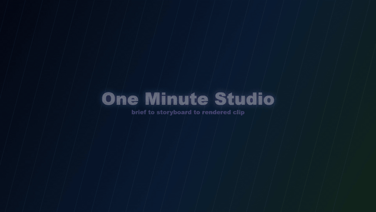

# ui2v

[中文](README_zh.md)

<p align="center">
  
</p>

<p align="center">
  <a href="https://www.npmjs.com/package/@ui2v/cli"></a>
  <a href="LICENSE"></a>
  
  
</p>

ui2v turns structured animation JSON into browser-rendered MP4 video. It is built for motion graphics that need to be reproducible: product launch clips, AI-authored explainers, data stories, UI demos, local-media edits, and library-heavy visual experiments that belong in Git.

The core idea is simple: describe the composition in JSON, preview it in a local browser studio, then export the same timeline to MP4 through Chrome/Edge automation, Canvas, WebCodecs, and Node.js.

## See The Output

The repository includes lightweight showcase GIFs so the project is visible before you run anything.

| Product opener | Studio workflow |
| --- | --- |
|  |  |
| `hero-ai-launch` style launch motion, title beats, product framing. | Preview, scrub, inspect, and export from the local browser studio. |

| Product/media composition | Render lab |
| --- | --- |
|  |  |
| Image, video, audio, waveform, and branded layout compositions. | Repeatable render checks, runtime frames, and export-focused workflows. |

## What It Can Render

ui2v is intentionally JSON-first, but it is not limited to static JSON primitives. Projects can combine:

- Canvas drawing and custom-code layers
- `image-layer`, `video-layer`, `audio-layer`, local `access/` assets, and muxed AAC audio
- Runtime Core segmented timelines with `timeline.segments[]`, transitions, camera metadata, markers, and inspectable frame plans
- Browser/npm libraries including `gsap`, `animejs`, `d3`, `mathjs`, `three`, `postprocessing`, `matter-js`, `cannon-es`, `pixi.js`, `p5`, `tsParticles`, `lottie-web`, `fabric`, `konva`, `paper`, `roughjs`, `katex`, `iconify`, and `opentype.js`

Each maintained example is designed so the named library visibly changes pixels in the output. A dependency that never renders does not count.

## Quick Start

Install and check the CLI:

```bash
npm install -g @ui2v/cli
ui2v doctor
```

Preview and render a real project:

```bash
ui2v validate examples/access-media/animation.json --verbose
ui2v preview examples/access-media/animation.json --pixel-ratio 2
ui2v render examples/access-media/animation.json -o .tmp/examples/access-media.mp4 --quality high
```

Run without a global install:

```bash
npx @ui2v/cli@latest render examples/library-timeline/animation.json -o library-timeline.mp4 --quality high
```

Use the local workspace build:

```bash
bun install
bun run build
node packages/cli/dist/cli.js preview examples/access-media/animation.json --pixel-ratio 1
```

## Maintained Examples

The `examples/` folder is the fastest way to understand what ui2v is good at. These are maintained as generation references and release smoke targets.

| Example | Main Effect | Real APIs Exercised |
| --- | --- | --- |
| [`basic-smoke`](examples/basic-smoke/README.md) | Premium Canvas opener and smallest end-to-end smoke test. | Canvas 2D, gradients, text, timing |
| [`access-media`](examples/access-media/README.md) | Local media studio with image, video, waveform, and muxed audio. | `image-layer`, `video-layer`, `audio-layer`, root `audio.tracks` |
| [`library-timeline`](examples/library-timeline/README.md) | Multi-library timeline with visible beats. | GSAP/SplitType, D3/math, THREE/postprocessing, Matter/simplex/Iconify |
| [`runtime-storyboard`](examples/runtime-storyboard/README.md) | Segmented runtime-core storyboard. | Runtime graph, transitions, camera metadata, inspect-runtime |
| [`pixi-signal`](examples/pixi-signal/README.md) | Rescue radar with particles, beams, scan rings, and signal nodes. | PixiJS Graphics and containers |
| [`paper-route`](examples/paper-route/README.md) | Route planning with smoothed vector travel. | Paper.js paths, symbols, smoothing |
| [`konva-launch-board`](examples/konva-launch-board/README.md) | Product launch board assembled from scene objects. | Konva Stage, Layer, Group, Rect, Text, Circle |
| [`anime-motion-rig`](examples/anime-motion-rig/README.md) | Kinetic motion rig driven by timeline state. | anime.js timeline/animate APIs |
| [`tween-control-room`](examples/tween-control-room/README.md) | Dashboard gauges with repeat/yoyo easing. | `@tweenjs/tween.js` Group and Tween |
| [`particles-aurora`](examples/particles-aurora/README.md) | Aurora made from a live particle engine canvas. | tsParticles |
| [`lottie-status-pack`](examples/lottie-status-pack/README.md) | Status cards that seek generated animationData each frame. | lottie-web |
| [`p5-flow-garden`](examples/p5-flow-garden/README.md) | Generative garden and noise-based light field. | p5.js |
| [`fabric-poster-lab`](examples/fabric-poster-lab/README.md) | Kinetic poster from editable object primitives. | Fabric.js StaticCanvas, groups, gradients |
| [`cannon-cargo-drop`](examples/cannon-cargo-drop/README.md) | Warehouse cargo drop with real rigid-body simulation. | cannon-es |
| [`type-systems-map`](examples/type-systems-map/README.md) | Technical type-system infographic. | KaTeX, Iconify, opentype.js |

Open the full index at [examples/README.md](examples/README.md).

## Preview Studio

`ui2v preview` starts a local browser workspace instead of a static file viewer. It includes:

- searchable project list for the current workspace
- responsive full-stage preview with correct aspect-ratio fitting
- play/pause, timeline scrubber, current time, fullscreen, and export actions
- live reload when the selected JSON changes
- runtime-core rendering path, so template and runtime projects use the same preview surface
- browser save/download flow for MP4 export

```bash
ui2v preview examples/access-media/animation.json --pixel-ratio 1
```

## Runtime Core

For timeline-heavy videos, use runtime projects with segmented storyboards:

```json
{
  "schema": "uiv-runtime",
  "timeline": {
    "segments": [
      {
        "id": "hook",
        "startTime": 0,
        "endTime": 2,
        "label": "Hook",
        "dependencies": ["gsap"]
      }
    ]
  }
}
```

Inspect the normalized scene graph and sampled frames:

```bash
ui2v inspect-runtime examples/runtime-storyboard/animation.json --time 1 --time 4 --json
```

## Local Media Workflow

Put user-provided files next to `animation.json`:

```text
my-video/
  animation.json
  access/
    product.png
    clip.webm
    clip-poster.jpg
    music.wav
```

Use `image-layer` for stills, `video-layer` for inserted clips, and root `audio.tracks` when the sound must be muxed into the exported MP4. For video, prefer browser-decodable H.264 MP4 or VP9 WebM and include `posterSrc` when possible.

## README Asset Workflow

Render MP4 first, then create compact README assets:

```bash
ui2v render examples/library-timeline/animation.json -o .tmp/examples/library-timeline.mp4 --quality high

ffmpeg -y -ss 0 -t 4.5 -i .tmp/examples/library-timeline.mp4 \
  -vf "fps=10,scale=640:-1:flags=lanczos,split[s0][s1];[s0]palettegen=max_colors=80[p];[s1][p]paletteuse=dither=bayer:bayer_scale=5" \
  -loop 0 assets/showcase/library-timeline.gif

ffmpeg -y -ss 1 -i .tmp/examples/library-timeline.mp4 \
  -frames:v 1 -vf "scale=1280:-1:flags=lanczos" -update 1 -q:v 3 \
  assets/showcase/library-timeline.jpg
```

For GitHub, prefer 4-6 second GIFs under 3 MB. Keep full MP4 files in `.tmp/examples`, release assets, issue attachments, or a CDN.

## AI Generation Prompt Shape

Good ui2v prompts are specific about story, timing, libraries, assets, and output:

```text
Create a ui2v animation JSON with four visible timeline beats:
1. GSAP/SplitType typography hook
2. D3/math data reveal
3. THREE/postprocessing depth shot
4. Matter/simplex/Iconify interaction

Each beat must have its own layer or segment, dependency list, visible proof,
and a render command.
```

The repo-local Codex skill lives at [skills/ui2v/SKILL.md](skills/ui2v/SKILL.md):

```bash
npx skills add illli-studio/ui2v --skill ui2v
```

## CLI Reference

```bash
ui2v doctor
ui2v validate animation.json --verbose
ui2v preview animation.json --pixel-ratio 2
ui2v inspect-runtime animation.json
ui2v render animation.json -o output.mp4 --quality high
```

Useful render options:

```bash
ui2v render animation.json -o output.mp4 --width 1920 --height 1080
ui2v render animation.json -o output.mp4 --quality ultra --render-scale 2
ui2v render animation.json -o output.mp4 --codec avc --bitrate 8000000
ui2v render animation.json -o output.mp4 --timeout 300 --no-headless
```

## Package Structure

```text
ui2v                 Short install package for the ui2v command
@ui2v/cli            Command-line interface
@ui2v/core           Project parser, validator, types, and shared helpers
@ui2v/runtime-core   Scene graph, timeline, frame plans, adapters, commands
@ui2v/engine         Canvas renderer, custom-code runtime, media, WebCodecs export
@ui2v/producer       System-browser preview server and MP4 render pipeline
```

## Requirements

- Node.js 18 or newer
- Bun 1.0 or newer for workspace development
- Local Chrome, Edge, or Chromium

ui2v uses `puppeteer-core`, so it does not download a bundled browser. If auto-detection fails, point it at your browser:

```powershell
$env:PUPPETEER_EXECUTABLE_PATH='C:\Program Files\Google\Chrome\Application\chrome.exe'; ui2v doctor
```

## Documentation

- [Quick Start](docs/quick-start.md)
- [Getting Started](docs/getting-started.md)
- [Examples](examples/README.md)
- [Architecture](docs/architecture.md)
- [Runtime Core](docs/runtime-core.md)
- [Renderer Notes](docs/renderer-notes.md)
- [Roadmap](docs/roadmap.md)
- [CLI Reference](packages/cli/README.md)

## Development

```bash
bun run build
bun run test
```

## License

MIT
