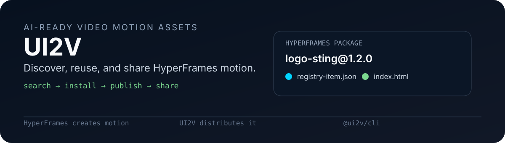

<p align="center">
  
</p>

<h1 align="center">UI2V</h1>

<p align="center">
  Let AI help you discover, install, and share video motion assets.
</p>

<p align="center">
  <a href="https://ui2v.com">ui2v.com</a>
  ·
  <a href="./docs/quick-start.md">Quick Start</a>
  ·
  <a href="./docs/getting-started.md">Getting Started</a>
  ·
  <a href="./README_zh.md">中文</a>
</p>

<p align="center">
  
  
  
</p>

<p align="center">
  
</p>

---

Motion work should be as reusable as UI work. UI2V gives finished HyperFrames
motion packages a searchable home, a versioned release path, and a simple way
for people and AI tools to pull them into a workspace.

HyperFrames creates, previews, and renders the motion. UI2V distributes the
finished package through discovery, installation, publishing, syncing, and
updates.

```bash
npm install -g @ui2v/cli@latest
ui2v search "logo sting"       # discover a reusable motion
ui2v install <slug>            # pull it into your workspace
ui2v motion publish ./motion --version 1.0.0
```

## The library workflow

| Move | What you get | Command |
| --- | --- | --- |
| Discover | Find reusable motion packages | `ui2v search`, `ui2v explore` |
| Install | Pull a package into your workspace | `ui2v install`, `ui2v update` |
| Publish | Share an original HyperFrames package | `ui2v motion publish` |
| Maintain | Keep local and registry state aligned | `ui2v sync`, `ui2v inspect` |

```text
HyperFrames authoring
  -> package folder
  -> ui2v login
  -> ui2v motion publish
  -> ui2v.com
```

The goal is to make motion components feel as reusable as UI components: named,
versioned, documented, and easy to pull into a workspace.

## Publish a package

```bash
ui2v login
ui2v motion publish ./my-motion --version 1.0.0
npx @ui2v/cli@latest install <slug>
```

Minimal package:

```text
my-motion/
├── registry-item.json
├── index.html
└── assets/
```

## Install

Install the scoped npm package. The binary is `ui2v`.

```bash
npm install -g @ui2v/cli@latest
ui2v --cli-version
ui2v --help
```

Run without a global install:

```bash
npx @ui2v/cli@latest search "logo sting"
npx @ui2v/cli@latest install <slug>
```

## Common Commands

```bash
ui2v login
ui2v search "lower third"
ui2v install <slug>
ui2v list
ui2v update --all
ui2v inspect <slug>
ui2v motion publish ./my-motion --version 1.0.0
ui2v sync --dry-run
ui2v upgrade
```

## Product boundary

| UI2V handles | HyperFrames handles |
| --- | --- |
| Registry search and discovery | Composition authoring |
| Package install and updates | Preview and playback |
| Publish and sync workflows | Rendering and export |
| CLI auth and ownership flows | Timeline and animation logic |

## Documentation and development

```bash
bun install
bun run build
bun run test
node packages/ui2v/bin/ui2v.js --help
```

For release readiness:

```bash
bun run --filter "@ui2v/cli" verify
```

- [Quick Start](./docs/quick-start.md) — install the CLI and run the first search.
- [Getting Started](./docs/getting-started.md) — publish and maintain packages.
- [Package Registry](./docs/package-registry.md) — advanced compatible package workflows.
- [Contributing](./CONTRIBUTING.md) — local development and repository conventions.

## Legacy JSON projects

<details>
<summary>Migrating from the old JSON renderer</summary>

The old `@ui2v/cli@1.x` JSON-to-MP4 workflow has been removed from the active
product. Rebuild those projects as HyperFrames packages, then publish them with
the current `ui2v` workflow. See the [migration notes](./docs/legacy-json-toolchain.md).

</details>

## License

[GPL-3.0-only](https://github.com/illli-studio/ui2v/tree/main#GPL-3.0-1-ov-file)
