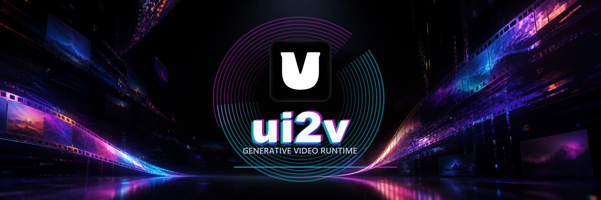
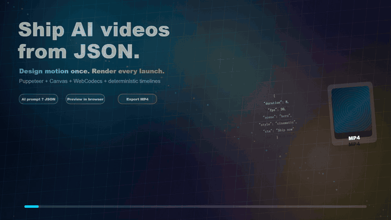
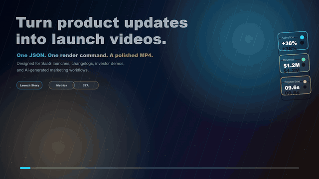
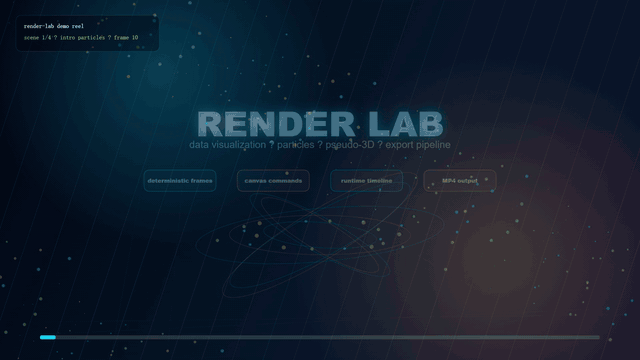
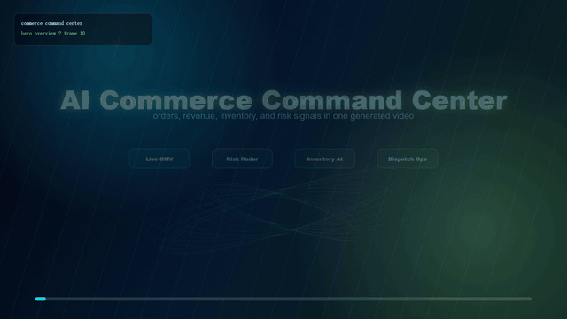

# ui2v

[English](README.md)

<p align="center">
  
</p>

<p align="center">
  <a href="https://www.npmjs.com/package/@ui2v/cli"></a>
  <a href="LICENSE"></a>
  
</p>

ui2v 是一个把 JSON 动画项目渲染成 MP4 的开源工具链。它使用本机浏览器环境（`puppeteer-core` 控制 Chrome/Edge/Chromium）、Canvas、WebCodecs 和 Node.js 文件输出，不会自动下载内置 Chromium。

如果你想做产品发布视频、AI 生成视频、数据故事、UI 演示、品牌开场，或者可以进入 Git 工作流的可复现动效系统，ui2v 会很适合。

## Codex Skill

安装仓库内置 skill：

```bash
npx skills add illli-studio/ui2v --skill ui2v
```

这个 skill 放在 [`skills/ui2v`](skills/ui2v/SKILL.md)，会引导 AI 先做分段分镜、选择 runtime/template JSON、使用 XYZ/深度/相机特征、组合 three、d3、gsap、物理、粒子、字体、 Lottie/图标等库，并完成 MP4 渲染和 README Showcase 素材打包。

## 效果展示

README 的示例应该在前五秒就让用户想试。下面这些片段都由 ui2v 渲染，并压缩成轻量 GIF，方便在 GitHub 首页直接预览。

| Hero AI Launch | Product Launch |
| --- | --- |
|  |  |
| 专门为 README 首屏设计的 AI launch trailer：电影感灯光、玻璃 UI、prompt 到 MP4 流程和最终 CTA。 | 高级 SaaS 发布风格，包含玻璃面板、功能节奏点和光扫效果。 |

| Render Lab | Commerce Command Center |
| --- | --- |
|  |  |
| 数据、粒子、伪 3D 深度、高能动效和多场景过渡。 | 面向指标、交易、运营和实时大屏的 dashboard 叙事演示。 |

> 建议：完整 MP4 放到 release assets、GitHub issue 附件或 CDN；仓库里只保留压缩后的 GIF/JPG 预览素材，放在 `assets/showcase`。

## 快速开始

安装短包名 CLI：

```bash
npm install -g @ui2v/cli
ui2v doctor
```

渲染一个精致的入门示例：

```bash
ui2v validate examples/hero-ai-launch/animation.json --verbose
ui2v preview examples/hero-ai-launch/animation.json --pixel-ratio 2
ui2v render examples/hero-ai-launch/animation.json -o .tmp/examples/hero-ai-launch.mp4 --quality high
```

也可以不全局安装：

```bash
npx @ui2v/cli render examples/hero-ai-launch/animation.json -o hero-ai-launch.mp4 --quality high
```

使用本地 workspace 构建：

```bash
bun install
bun run build
node packages/cli/dist/cli.js render examples/hero-ai-launch/animation.json -o .tmp/examples/hero-ai-launch.mp4 --quality high
```

`preview` 会打开本地 Studio 页面，左侧可搜索 JSON 项目列表，支持播放控制、逐帧拖动、播放速度、适配/剧场/全屏模式、runtime debug overlay、当前帧 PNG 快照、复制 CLI 渲染命令，以及把当前项目直接 **Export MP4** 到 `.tmp/examples`。

## 示例画廊

示例不应该只是测试用例，更应该是营销资产。最强的示例要让用户一眼知道“我也想生成这个”。

| 示例 | 为什么吸引人 | 渲染命令 |
| --- | --- | --- |
| [`examples/hero-ai-launch`](examples/hero-ai-launch/README.zh.md) | README hero trailer：电影感灯光、玻璃 UI 面板、prompt 到 MP4 的叙事和最终 CTA 定帧。 | `ui2v render examples/hero-ai-launch/animation.json -o .tmp/examples/hero-ai-launch.mp4 --quality high` |
| [`examples/runtime-core/uiv-runtime-one-minute-studio.json`](examples/runtime-core/uiv-runtime-one-minute-studio.json) | 完整 AI 视频工作室宣传片，多场景、界面编排、空间层次和 CTA 节奏都比较完整。 | `ui2v render examples/runtime-core/uiv-runtime-one-minute-studio.json -o .tmp/examples/uiv-runtime-one-minute-studio.mp4 --quality high` |
| [`examples/product-showcase`](examples/product-showcase/README.zh.md) | 用户很容易代入自己的 SaaS、App 或开发者工具，是最适合转化的产品发布示例。 | `ui2v render examples/product-showcase/animation.json -o .tmp/examples/product-showcase.mp4 --quality high` |
| [`examples/render-lab`](examples/render-lab/README.zh.md) | 展示粒子、数据动效、伪 3D、灯光和多场景转场，适合作为能力合集。 | `ui2v render examples/render-lab/animation.json -o .tmp/examples/render-lab.mp4 --quality high` |
| [`examples/runtime-core/uiv-runtime-commerce-command-center.json`](examples/runtime-core/uiv-runtime-commerce-command-center.json) | 指标大屏、交易数据、运营中台和 command center 风格的 dashboard 叙事。 | `ui2v render examples/runtime-core/uiv-runtime-commerce-command-center.json -o .tmp/examples/uiv-runtime-commerce-command-center.mp4 --quality high` |
| [`examples/logo-reveal`](examples/logo-reveal/README.zh.md) | 短小的第一次运行品牌开场，适合快速证明 CLI 能跑通。 | `ui2v render examples/logo-reveal/animation.json -o .tmp/examples/logo-reveal.mp4 --quality high` |
| [`examples/basic-text`](examples/basic-text/README.zh.md) | 最小 smoke test，用来检查本地浏览器和渲染环境。 | `ui2v render examples/basic-text/animation.json -o .tmp/examples/basic-text.mp4` |

## README 素材流程

先渲染高质量 MP4，再导出适合 GitHub 展示的短预览素材：

```bash
ui2v render examples/hero-ai-launch/animation.json -o .tmp/examples/hero-ai-launch.mp4 --quality high

ffmpeg -y -ss 0 -t 4.5 -i .tmp/examples/hero-ai-launch.mp4 \
  -vf "fps=10,scale=640:-1:flags=lanczos,split[s0][s1];[s0]palettegen=max_colors=80[p];[s1][p]paletteuse=dither=bayer:bayer_scale=5" \
  -loop 0 assets/showcase/hero-ai-launch.gif

ffmpeg -y -ss 1 -i .tmp/examples/hero-ai-launch.mp4 \
  -frames:v 1 -vf "scale=1280:-1:flags=lanczos" -update 1 -q:v 3 \
  assets/showcase/hero-ai-launch.jpg
```

README 里建议放 4-6 秒、3 MB 以下的 GIF；完整 MP4 不建议直接进仓库，可以放 release assets 或 CDN。

## 用 AI 生成新视频

ui2v 项目本质是 JSON，所以非常适合让 AI 先起草，再用 CLI 在本地预览和渲染。好的提示词通常包含画幅、时长、分辨率、视觉风格、场景安排和输出路径。

```text
Create a ui2v animation JSON for an 8-second 1920x1080 hero demo that would look
impressive at the top of a GitHub README. Make it feel like a premium AI product
launch: cinematic dark background, glass UI panels, kinetic data cards, luminous
depth layers, smooth camera movement, readable product copy, and a final CTA.
Save it as examples/ai-launch/animation.json and include render commands plus a
short README description.
```

如果要生成 logo 或品牌视频，可以直接让它画标识：

```text
Create a ui2v logo reveal for ui2v.com that feels like a premium open-source
launch trailer. Draw the mark, wordmark, browser-to-video pipeline, glowing frame
grid, progress pulses, and a memorable final lockup entirely in Canvas. Keep it
readable as a 5-second README GIF.
```

## 创建自己的项目

```bash
ui2v init my-video
cd my-video
ui2v preview animation.json --pixel-ratio 2
ui2v render animation.json -o output.mp4 --quality high
```

`init` 会生成一个 6 秒、1080p 的 starter clip。想要更吸引人的开箱示例，优先看 `examples/hero-ai-launch`、`examples/product-showcase` 和 `examples/render-lab`，它们展示了更强的叙事节奏、玻璃 UI 和 Canvas 视觉效果。

## 常用命令

```bash
ui2v doctor
ui2v validate animation.json --verbose
ui2v preview animation.json --pixel-ratio 2
ui2v inspect-runtime animation.json
ui2v render animation.json -o output.mp4 --quality high
```

常用渲染参数：

```bash
ui2v render animation.json -o output.mp4 --width 1920 --height 1080
ui2v render animation.json -o output.mp4 --quality ultra --render-scale 2
ui2v render animation.json -o output.mp4 --codec avc --bitrate 8000000
ui2v render animation.json -o output.mp4 --timeout 300 --no-headless
```

## 包结构

```text
ui2v                 安装 ui2v 命令的短包名
@ui2v/cli            命令行实现
@ui2v/core           类型、解析器、校验器和共享工具
@ui2v/runtime-core   场景图、时间线、帧计划、适配器和绘制命令
@ui2v/engine         浏览器 Canvas 渲染器和 WebCodecs 导出器
@ui2v/producer       通过 puppeteer-core 驱动本机浏览器完成预览和 MP4 渲染
```

## 渲染流程

```text
animation.json
  -> CLI 解析并校验输入
  -> producer 启动本地静态服务
  -> puppeteer-core 连接本机 Chrome、Edge 或 Chromium
  -> 浏览器加载 core/runtime/engine bundle
  -> runtime 根据共享时间线计算帧状态
  -> engine 将每一帧绘制到 Canvas
  -> WebCodecs 在浏览器里编码 MP4
  -> producer 将视频文件写入磁盘
```

## 环境要求

- Node.js 18 或更新版本
- 本地 workspace 开发需要 Bun 1.0 或更新版本
- 本机已安装的 Chrome、Edge 或 Chromium

主渲染链路不需要 Electron、FFmpeg 或 `node-canvas`。

ui2v 使用 `puppeteer-core`，不会下载内置 Chromium。请先本地安装 Chrome、Edge 或 Chromium。如果自动检测失败，可以手动指定浏览器路径：

```bash
PUPPETEER_EXECUTABLE_PATH=/path/to/chrome ui2v doctor
```

Windows PowerShell：

```powershell
$env:PUPPETEER_EXECUTABLE_PATH='C:\Program Files\Google\Chrome\Application\chrome.exe'; ui2v doctor
```

## 文档

- [快速开始](docs/quick-start.zh.md)
- [入门指南](docs/getting-started.zh.md)
- [架构](docs/architecture.zh.md)
- [Runtime Core](docs/runtime-core.zh.md)
- [渲染器说明](docs/renderer-notes.zh.md)
- [路线图](docs/roadmap.zh.md)
- [开源渲染器预览](docs/open-source-preview-article.zh.md)
- [CLI 参考](packages/cli/README.zh.md)

英文版本放在同目录的 `.md` 文件中。

## 开发

```bash
bun run build
bun run test
```

常用专项检查：

```bash
bun run test:unit
bun run test:examples
bun run test:validate
bun run test:smoke
```

## 当前限制

- MP4 是主要生产输出格式。
- 默认编码器是 AVC/H.264。只有本地浏览器支持时，才可以请求 HEVC。
- 浏览器端 ESM 依赖目前通过 producer import map 中固定的 CDN URL 加载。
- 长视频或高分辨率视频目前会先以 base64 从浏览器传回 Node，再写入磁盘，实现简单但对内存不够友好。

## 许可

MIT
