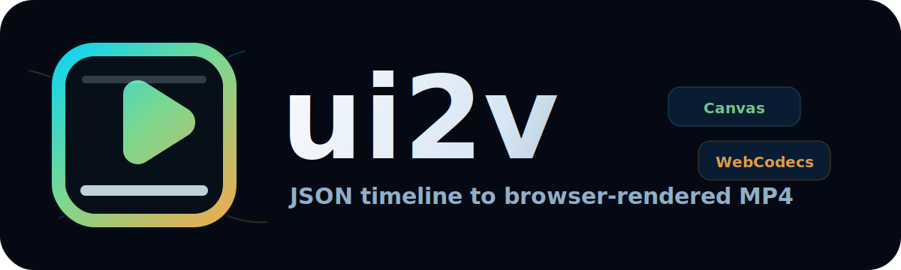

# ui2v

[English](README.md)

<p align="center">
  
</p>

<p align="center">
  <a href="https://www.npmjs.com/package/ui2v"></a>
  <a href="LICENSE"></a>
  
</p>

ui2v 可以把结构化动画 JSON 渲染成浏览器生成的 MP4 视频。它会通过 Puppeteer 启动本地 Chromium 浏览器，在 Canvas 上计算并绘制时间线，通过 WebCodecs 编码，最后由 Node.js 写入视频文件。

如果你想把动效、产品视频、数据故事、UI 演示、品牌开场或批量生成的视频放进代码工作流，ui2v 会很顺手：一个 JSON 文件就是一个可验证、可预览、可渲染的视频项目。

## 快速开始

安装短包名 CLI：

```bash
npm install -g ui2v
ui2v doctor
```

渲染推荐的精美入门示例：

```bash
ui2v validate examples/logo-reveal/animation.json --verbose
ui2v preview examples/logo-reveal/animation.json --pixel-ratio 2
ui2v render examples/logo-reveal/animation.json -o .tmp/logo-reveal.mp4 --quality high
```

也可以不全局安装：

```bash
npx ui2v render examples/logo-reveal/animation.json -o logo-reveal.mp4 --quality high
```

使用本地 workspace 构建：

```bash
bun install
bun run build
node packages/cli/dist/cli.js render examples/logo-reveal/animation.json -o .tmp/logo-reveal.mp4
```

## 可以做什么

| 示例 | 适合场景 | 渲染命令 |
| --- | --- | --- |
| [`examples/logo-reveal`](examples/logo-reveal/README.zh.md) | 第一次运行、品牌开场、README 演示视频 | `ui2v render examples/logo-reveal/animation.json -o .tmp/logo-reveal.mp4 --quality high` |
| [`examples/product-showcase`](examples/product-showcase/README.zh.md) | 产品发布视频、功能预告 | `ui2v render examples/product-showcase/animation.json -o .tmp/product-showcase.mp4 --quality high` |
| [`examples/render-lab`](examples/render-lab/README.zh.md) | 数据、粒子、伪 3D、多场景演示 | `ui2v render examples/render-lab/animation.json -o .tmp/render-lab.mp4 --quality high` |
| [`examples/basic-text`](examples/basic-text/README.zh.md) | 最小环境检查和验证 | `ui2v render examples/basic-text/animation.json -o .tmp/basic-text.mp4` |

## 用 AI 生成新视频

ui2v 项目本质是 JSON，所以非常适合让 AI 先起草，再用 CLI 在本地预览和渲染。好的提示词通常包含画幅、时长、分辨率、视觉风格、场景安排和输出路径。

```text
Create a ui2v animation JSON for a 6-second 1920x1080 product launch video.
Use a custom-code Canvas layer. Make it feel like a premium SaaS release:
dark glass interface, clear product wordmark, animated data cards, light sweep,
and a final CTA. Save it as examples/my-launch/animation.json and include a
README with validate, preview, and render commands.
```

如果要生成 logo 或品牌视频，可以直接让它画标识：

```text
Create a ui2v logo reveal for ui2v.com. Draw the logo, wordmark, browser-video
pipeline labels, and a progress bar entirely in Canvas. Keep it polished,
readable, and suitable for a GitHub README demo.
```

## 创建自己的项目

```bash
ui2v init my-video
cd my-video
ui2v preview animation.json --pixel-ratio 2
ui2v render animation.json -o output.mp4 --quality high
```

`init` 生成的是一个很小的起点。想要更有观赏性的基础模板，可以复制 `examples/logo-reveal` 或 `examples/product-showcase`，然后替换文案、颜色、节奏和 Canvas 绘制逻辑。

## 常用命令

```bash
ui2v doctor
ui2v validate animation.json --verbose
ui2v preview animation.json --pixel-ratio 2
ui2v inspect-runtime animation.json
ui2v render animation.json -o output.mp4 --quality high
```

常用渲染参数：

```bash
ui2v render animation.json -o output.mp4 --width 1280 --height 720
ui2v render animation.json -o output.mp4 --quality ultra --render-scale 2
ui2v render animation.json -o output.mp4 --codec avc --bitrate 8000000
ui2v render animation.json -o output.mp4 --timeout 300 --no-headless
```

## 包结构

```text
ui2v                 安装 ui2v 命令的短包名
@ui2v/cli            命令行实现
@ui2v/core           类型、解析器、校验器和共享工具
@ui2v/runtime-core   场景图、时间线、帧计划、适配器和绘制命令
@ui2v/engine         浏览器 Canvas 渲染器和 WebCodecs 导出器
@ui2v/producer       基于 Puppeteer 的预览和 MP4 渲染管线
```

## 渲染流程

```text
animation.json
  -> CLI 解析并校验输入
  -> producer 启动本地静态服务
  -> Puppeteer 启动 Chrome、Edge 或 Chromium
  -> 浏览器加载 core/runtime/engine bundle
  -> runtime 根据共享时间线计算帧状态
  -> engine 将每一帧绘制到 Canvas
  -> WebCodecs 在浏览器里编码 MP4
  -> producer 将视频文件写入磁盘
```

## 环境要求

- Node.js 18 或更新版本
- 本地 workspace 开发需要 Bun 1.0 或更新版本
- Chrome、Edge、Chromium，或 Puppeteer 安装的 Chromium

主渲染链路不需要 Electron、FFmpeg 或 `node-canvas`。

如果 Puppeteer 下载浏览器失败，而你已经安装了 Chrome 或 Edge，可以跳过内置浏览器下载：

```bash
PUPPETEER_SKIP_DOWNLOAD=true bun install
```

Windows PowerShell：

```powershell
$env:PUPPETEER_SKIP_DOWNLOAD='true'; bun install
```

## 文档

- [快速开始](docs/quick-start.zh.md)
- [入门指南](docs/getting-started.zh.md)
- [架构](docs/architecture.zh.md)
- [Runtime Core](docs/runtime-core.zh.md)
- [渲染器说明](docs/renderer-notes.zh.md)
- [路线图](docs/roadmap.zh.md)
- [开源渲染器预览](docs/open-source-preview-article.zh.md)
- [CLI 参考](packages/cli/README.zh.md)

英文版本放在同目录的 `.md` 文件中。

## 开发

```bash
bun run build
bun run test
```

常用专项检查：

```bash
bun run test:unit
bun run test:examples
bun run test:validate
bun run test:smoke
```

## 当前限制

- MP4 是主要生产输出格式。
- 默认编码器是 AVC/H.264。只有本地浏览器支持时，才可以请求 HEVC。
- 浏览器端 ESM 依赖目前通过 producer import map 中固定的 CDN URL 加载。
- 长视频或高分辨率视频目前会先以 base64 从浏览器传回 Node，再写入磁盘，实现简单但对内存不够友好。

## 许可

MIT
