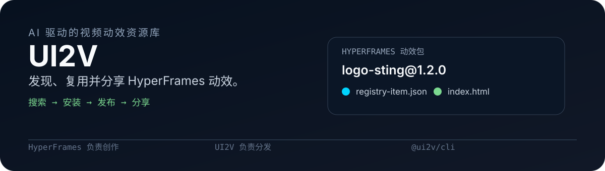

<p align="center">
  
</p>

<h1 align="center">UI2V</h1>

<p align="center">
  让 AI 帮你发现、安装和分享视频动效资源。
</p>

<p align="center">
  <a href="https://ui2v.com">ui2v.com</a>
  ·
  <a href="./docs/quick-start.zh.md">快速开始</a>
  ·
  <a href="./docs/getting-started.zh.md">入门指南</a>
  ·
  <a href="./README.md">English</a>
</p>

<p align="center">
  
  
  
</p>

<p align="center">
  
</p>

---

动效作品也应该像 UI 组件一样可复用。UI2V 为完成的 HyperFrames 动效包提供一个
可发现、可安装、可发布、可同步的资源库，让人和 AI 工具都能快速复用。

HyperFrames 负责创作、预览和渲染；UI2V 负责完成后的动效包分发、版本和协作。

```bash
npm install -g @ui2v/cli@latest
ui2v search "logo sting"       # discover a reusable motion
ui2v install <slug>            # pull it into your workspace
ui2v motion publish ./motion --version 1.0.0
```

## 资源库工作流

| 动作 | 结果 | 命令 |
| --- | --- | --- |
| 发现 | 找到可复用的动效包 | `ui2v search`, `ui2v explore` |
| 安装 | 拉取到当前 workspace | `ui2v install`, `ui2v update` |
| 发布 | 分享原创 HyperFrames 动效 | `ui2v motion publish` |
| 维护 | 保持本地与资源库同步 | `ui2v sync`, `ui2v inspect` |

```text
HyperFrames authoring
  -> package folder
  -> ui2v login
  -> ui2v motion publish
  -> ui2v.com
```

目标是让 motion component 像 UI component 一样有名称、有版本、有文档，
也能被轻松拉进 workspace。

## 发布一个动效包

```bash
ui2v login
ui2v motion publish ./my-motion --version 1.0.0
npx @ui2v/cli@latest install <slug>
```

最小 package：

```text
my-motion/
├── registry-item.json
├── index.html
└── assets/
```

## 安装

安装带作用域的 npm 包。binary 是 `ui2v`。

```bash
npm install -g @ui2v/cli@latest
ui2v --cli-version
ui2v --help
```

也可以不全局安装：

```bash
npx @ui2v/cli@latest search "logo sting"
npx @ui2v/cli@latest install <slug>
```

## 常用命令

```bash
ui2v login
ui2v search "lower third"
ui2v install <slug>
ui2v list
ui2v update --all
ui2v inspect <slug>
ui2v motion publish ./my-motion --version 1.0.0
ui2v sync --dry-run
ui2v upgrade
```

## 产品边界

| UI2V 负责 | HyperFrames 负责 |
| --- | --- |
| Registry search and discovery | Composition authoring |
| Package install and updates | Preview and playback |
| Publish and sync workflows | Rendering and export |
| CLI auth and ownership flows | Timeline and animation logic |

## 文档与开发

```bash
bun install
bun run build
bun run test
node packages/ui2v/bin/ui2v.js --help
```

发布前验证：

```bash
bun run --filter "@ui2v/cli" verify
```

- [快速开始](./docs/quick-start.zh.md) — 安装 CLI 并完成第一次搜索。
- [入门指南](./docs/getting-started.zh.md) — 发布和维护动效包。
- [Package Registry](./docs/package-registry.zh.md) — 兼容包和高级工作流。
- [贡献指南](./CONTRIBUTING.md) — 本地开发和仓库约定。

## 旧 JSON 项目

<details>
<summary>从旧版 JSON renderer 迁移</summary>

旧的 `@ui2v/cli@1.x` JSON-to-MP4 工作流已从当前产品方向移除。请把旧项目重建为
HyperFrames package，再用当前 `ui2v` 注册表 CLI 发布。详见
[旧 JSON 工具链](./docs/legacy-json-toolchain.zh.md)。

</details>

## License

[GPL-3.0-only](https://github.com/illli-studio/ui2v/tree/main#GPL-3.0-1-ov-file)
